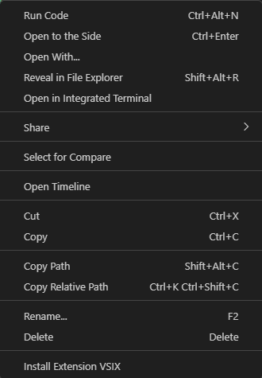
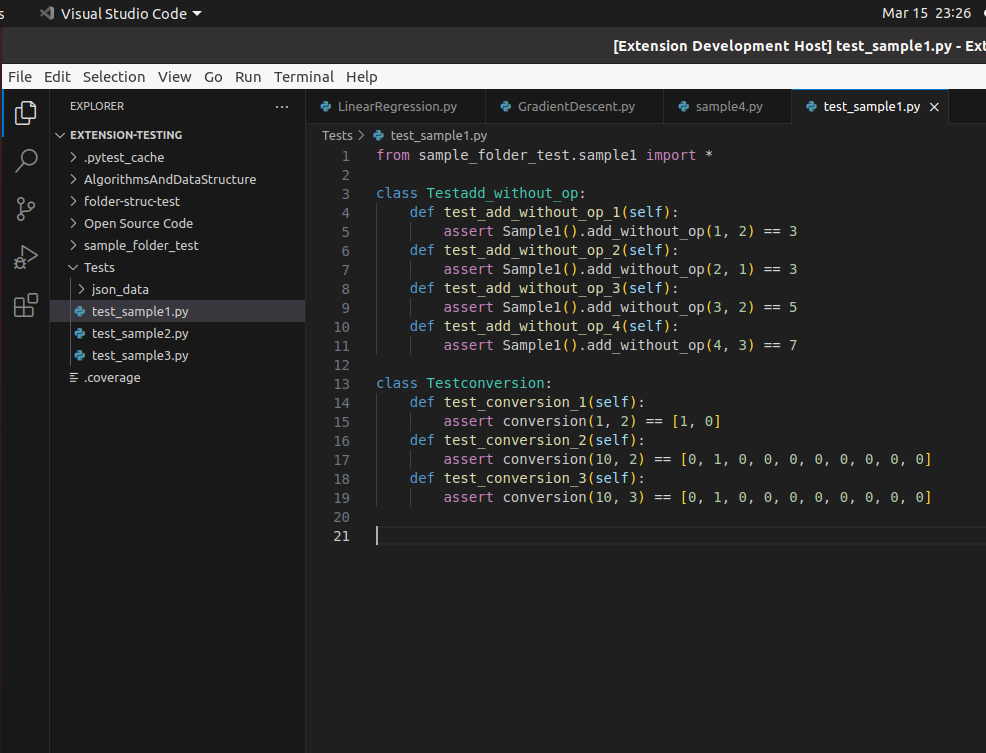

# Automated unit test generation with Large Language Models (LLMs)

This repo contains the code to generate unit tests with open source LLMs. Currently it supports CodeGen and replit-CodeInstruct. StarCoder is supported but it requires a larger amount of GPU RAM for usability.

# Table of contents

- [Installation](#installation)
- [Running the application](#running-the-application)
  - [Starting the server](#starting-the-server)
  - [Installing the VS Code extension](#installing-the-vs-code-extension)
- [Using the application](#using-the-application)
  - [Using the CLI tool](#using-the-cli-tool)
  - [Using the VS Code extension](#using-the-vs-code-extension)
  - [Executing unit tests](#executing-unit-tests)
- [Further Improvements](#further-improvements)
  - [Instruct based models](#instruct-based-models)
  - [DynaMOSA, PynGuin](#dynamosa--pynguin)
- [Further reading](#further-reading)
- [References](#references)

# Installation

**Check Node and NPM versions with**

```
node -v
npm -v
```

NodeJS version at the time of development is in `v18.16.0` and NPM version is in `9.5.1`

**Check Python version with**

```
python -V
```

The Python version at the time of development is 3.8.

0. (Optional) Creating a virtual environment

   You are advised to work with the repo in a virtual environment, as some modules might return errors. I used virtualenv for creating and managing virtual environments, but you can use any other libraries.

   ```
   pip install virtualenv
   ```

   ```
   virtualenv your_environment_name
   ```

   Activate the environment:

   (Linux)

   ```
   source your_environment_name/bin/activate
   ```

   (Windows)

   ```
   your_environment_name\Scripts\activate
   ```

1. Installing requirements

   **Working in an online environment**

   All requirements for this repo are found in the `requirements.txt` file. Install them with

   ```
   pip install -r requirements.txt
   ```

   **Working in an offline environment**

   For working with the requirements offline, you can install the wheels into a directory of choice. Before installing them in the offline environment. Move the `requirements.txt` folder into the folder for the wheels before downloading the wheels.

   ```
   mkdir wheels_folder_name
   ```

   Enter the wheels folder and install the wheels from `requirements.txt`

   ```
   cd wheels_folder_name
   pip download -r requirements.txt
   ```

   The wheels are now downloaded and you can install the requirements in an offline environment. Transfer the wheels folder to your offline machine.

   Then enter the folder and download the wheels from `requirments.txt`

   ```
   pip install -r requirements.txt --find-links="wheels_folder_name" --no-index --no-deps
   ```

   If there are any missing modules, repeat the steps above but pip install the specific modules instead.

2. Installing models from HuggingFace

   All models used are the pretrained models taken from HuggingFace. Install them to a directory of choice on the local device for usage offline.

   (CodeGen) \
   To install CodeGen locally, run this code segment.

   ```
   from transformers import AutoTokenizer, AutoModelForCausalLM

   model = AutoModelForCausalLM.from_pretrained("Salesforce/codegen-2B-mono").save_pretrained(path_to_model)
   ```

   (StarCoder) \
   To install StarCoder locally, run this code segment.

   ```
   from transformers import AutoTokenizer, AutoModelForCausalLM

   model = AutoModelForCausalLM.from_pretrained("bigcode/starcoder").save_pretrained(path_to_model)
   ```

   ([Replit-CodeInstruct](https://huggingface.co/teknium/Replit-v2-CodeInstruct-3B)) \
   Follow the link above to HuggingFace repo. From there, navigate to the _Files and Versions_ section, and download all the files there excluding `.gitatttrbutes` and `README.md`.

   You might have to copy the folder and paste it into the same directory as the server file, if you get a HuggingFace error. Even after specifying the path to the Replit-CodeInstrct folder.

   Once the above steps are complete, go to `config.ini` and specify the path to the folder that the respective models are stored in.

   For more information on the models visit the links below: \
   ([CodeGen](https://huggingface.co/docs/transformers/model_doc/codegen)) \
   ([Replit-CodeInstruct](https://huggingface.co/teknium/Replit-v2-CodeInstruct-3B)) \
   ([StarCoder](https://huggingface.co/bigcode/starcoder))

# Running the application

## Starting the server

Activate the virtual environment before starting the server. Navigate to `server-model-py` and run

```
python server.py
```

The server will initialize the model and its tokenizer, before listening for requests. The server is now ready to receive calls to it from the extension.

## Installing the VS Code extension

Ensure that you have node installed on your machine by running

```
node -v
```

A version number `v18.16.0` should be returned. If not check your npm installation.

Go to the folder containing your extension and run

```
vsce package
```



This will generate a `.VSIX` file. You can now right click on the `.VSIX` file to install the extension.

# Using the application

## Using the CLI tool

The CLI tool has 3 options.

1. **--dir_under_test** \
   This is a **required argument**, and it specifies the path to the root directory that we want to test. The input has to be the **absolute path to the directory**.

2. **--tests_dir** \
   This is a **required argument** and it specifies the path to the output folder. The input has to be the **absolute path to the directory**.

3. **--whole_dir** \
   This is an **optional argument**. This informs the CLI tool whether or not to recursively look through the directory under test to generate tests for files within nested subfolders.

## Using the VS Code extension

Below is an example of the extension. Given a working directory which you are currently developing in, you have the option to only test files within the current directory or to test files within nested directories.

<p float="left">
    
    
</p>

The test cases will be generated in the `Tests/` folder.

## Executing unit tests

The import paths to the files containing the functions under tests will be written into the test files. Simply run pytest using coverage to execute the tests.

```
coverage run -m pytest
```

To generate the coverage report

```
coverage report
```

You can refer to the [pytest](https://docs.pytest.org/en/7.4.x/) and [coverage](https://coverage.readthedocs.io/en/7.2.7/) documentation for more information.

# Further Improvements

The current implementation faces several limitations.

1. After debugging minor code errors, some of the generated code display a host of issues. From using different declarations to the imports, invoking functions wrongly, repeated test cases and test cases that do not properly capture edge cases.

2. This form of unit test generation is a type of _Black Box Testing_. Black box testing is able to test a functions ability to perform its function. However this does not suggest that black box testing can in fact detect logical errors. In fact "logically flawed solutions can still pass all simple tests and be misconsidered as correct due to testing inadequacy."[[1]](#references)

## Instruct based models

A simple way to surmount these problem is to leverage the use of instruct models. Models that are finetuned on code and instructions. Implementing Instruct based code generation LLMs like _Replit-CodeInstruct_ produce qualitatively better tests than open source code generation models like CodeGen-2B.

However this LLMs are still unable to test further than the black box testing.

## DynaMOSA, PynGuin

There are currently solutions that do not employ the use of LLMs to generate test cases automatically. Some examples are PynGuin for Python, Evosuite for Java, IntelliTest for C# among many others.

For a Python based test generation, it treats the unit test generation as a optimization problem and employs the use of Dynamic Multi Objective Searching Algorithms (DynaMOSA)[[2]](#references) to generate test cases that optimize branch coverage of code.

However, such solutions still do not understand the internal workings of the code base and are still performing Black Box testing.

# Further reading

1. [Automated Java test generation](https://randoop.github.io/randoop/)
2. [Automated C# test generation](https://learn.microsoft.com/en-us/visualstudio/test/intellitest-manual/?view=vs-2022)
3. [An empirical study on PynGuin](https://arxiv.org/abs/2111.05003)

# References

<a id="1">[1]</a>
Liu, J., Xia, C. S., Wang, Y., & Zhang, L. (2023). Is Your Code Generated by ChatGPT Really Correct? Rigorous Evaluation of Large Language Models for Code Generation. arXiv preprint arXiv:2305.01210. https://doi.org/https://doi.org/10.48550/arXiv.2305.01210 \
<a id="2">[2]</a>
Lukasczyk, S., & Fraser, G. (2022). Pynguin: Automated Unit Test Generation for Python [Conference paper]. https://doi.org/10.1145/3510454.3516829
