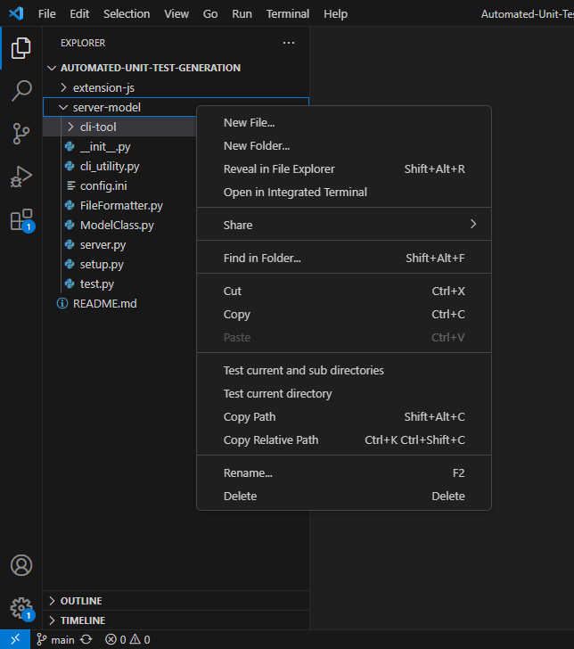

# Automated unit test generation with Large Language Models (LLMs)
This repo contains the code to generate unit tests with open source LLMs. Currently it supports CodeGen and replit-CodeInstruct. StarCoder is supported but it requires a larger amount of GPU RAM for usability.

# Installation

**Check Node and NPM versions with**
```
node -v
npm -v
```
NodeJS version at the time of development is in `v18.16.0` and NPM version is in `9.5.1`


0. (Optional) Creating a virtual environment

    You are advised to work with the repo in a virtual environment, as some modules might return errors. I used virtualenv for creating and managing virtual environments, but you can use any other libraries.

    ```
    pip install virtualenv
    ```
    ```
    virtualenv your_environment_name 
    ```

    Activate the environment:

    (Linux)
    ```
    source your_environment_name/bin/activate
    ```

    (Windows)
    ```
    your_environment_name\Scripts\activate
    ``` 

1. Installing requirements

    **Working in an online environment**

    All requirements for this repo are found in the `requirements.txt` file. Install them with
    ```
    pip install -r requirements.txt
    ```

    **Working in an offline environment**

    For working with the requirements offline, you can install the wheels into a directory of choice. Before installing them in the offline environment. Move the `requirements.txt` folder into the folder for the wheels before downloading the wheels. 

    ```
    mkdir wheels_folder_name
    ```

    Enter the wheels folder and install the wheels from `requirements.txt`

    ```
    cd wheels_folder_name
    pip download -r requirements.txt
    ```

    The wheels are now downloaded and you can install the requirements in an offline environment. Transfer the wheels folder to your offline machine.   

    Then enter the folder and download the wheels from `requirments.txt` 
    ```
    pip install -r requirments.txt --find-links="wheels_folder_name" --no-index --no-deps
    ```

    If there are any missing modules, repeat the steps above but pip install the specific modules instead.

2. Installing models from HuggingFace

    All models used are the pretrained models taken from HuggingFace. Install them to a directory of choice on the local device for usage offline. 

    In `config.ini` specify the path to the folder that the respective models are stored in. 

    ([CodeGen](https://huggingface.co/docs/transformers/model_doc/codegen))
    ```
    from transformers import AutoTokenizer, AutoModelForCausalLM

    model = AutoModelForCausalLM.from_pretrained("Salesforce/codegen-2B-mono").save_pretrained(path_to_model)
    ```

    ([StarCoder](https://huggingface.co/bigcode/starcoder))
    ```
    from transformers import AutoTokenizer, AutoModelForCausalLM

    model = AutoModelForCausalLM.from_pretrained("bigcode/starcoder").save_pretrained(path_to_model)
    ```

    ([Replit-CodeInstruct](https://huggingface.co/teknium/Replit-v2-CodeInstruct-3B))

    Follow the link above to HuggingFace repo. From there, navigate to the *Files and Versions* section, and download all the files there excluding `.gitatttrbutes` and `README.md`. 

    You might have to copy the folder and paste it into the same directory as the server file, if you get a HuggingFace error. Even after specifying the path to the Replit-CodeInstrct folder. 

# Running the application

## Starting the server
Activate the virtual environment before starting the server. Navigate to `server-model-py` and run
```
python server.py
```
The server will initialize the model and its tokenizer, before listening for requests. The server is now ready to receive calls to it from the extension.

## Installing the VS Code extension
Ensure that you have node installed on your machine by running
```
node -v
```
A version number `v18.16.0` should be returned. If not check your npm installation.

Go to the folder containing your extension and run 
```
vsce package
```
This will generate a `.VSIX` file. You can now right click on the `.VSIX` file to install the extension anywhere.

# Using the application

## Using the CLI tool
The CLI tool has a 3 options.

1. **--dir_under_test** \
    This is a **required argument**, and it specifies the path to the root directory that we want to test. The input has to be the **absolute path to the directory**. 

2. **--tests_dir** \
    This is a **required argument** and it specifies the path to the output folder. The input has to be the **absolute path to the directory**. 

3. **--whole_dir** \
    This is an **optional argument**. This informs the CLI tool whether or not to recursively look through the directory under test to generate tests for files within nested subfolders. 

## Using the VS Code extension
Below is an example of the extension. Given a working directory which you are currently developing in, you have the option to only test files within the current directory or to test files within nested directories.

<p float="left">
    
    
</p>


The test cases will be generated in the `Tests/` folder. 
